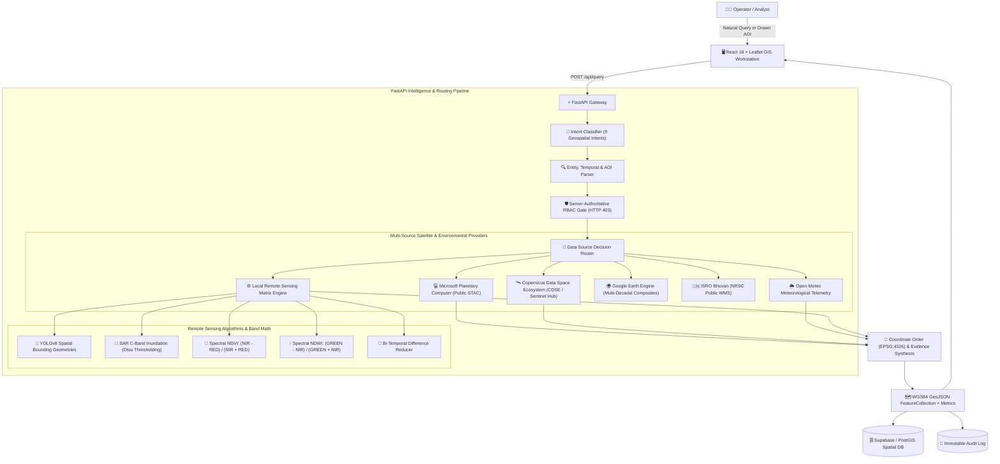

# SATQUERY AI — Multimodal Satellite Intelligence & Remote Sensing Platform

> **ASK EARTH. GET INTELLIGENCE.**  
> *Transforming natural language questions and survey AOIs into verified multi-source Earth Observation workflows, SAR radar inundation metrics, multi-spectral indices (NDVI/NDWI), meteorological context fusion, and EPSG:4326 vector geometries with server-authoritative role-based access control.*

---

## 🌐 Live Production Links & Interactive Documentation

| Service | Status | Live URL |
| :--- | :--- | :--- |
| 🚀 **Live Web Platform (Frontend)** | 🟢 **Operational** | [https://pavansreeram15-dev.github.io/SATQUERY/](https://pavansreeram15-dev.github.io/SATQUERY/) |
| ⚡ **Live Cloud API Backend (FastAPI)** | 🟢 **Operational** | [https://satquery-backend-9xen.onrender.com](https://satquery-backend-9xen.onrender.com) |
| 📖 **Interactive Swagger API Docs** | 🟢 **Live Interactive** | [https://satquery-backend-9xen.onrender.com/docs](https://satquery-backend-9xen.onrender.com/docs) |
| 📑 **ReDoc API Documentation** | 🟢 **Live Reference** | [https://satquery-backend-9xen.onrender.com/redoc](https://satquery-backend-9xen.onrender.com/redoc) |
| 🩺 **Backend Health Telemetry** | 🟢 **Live JSON** | [https://satquery-backend-9xen.onrender.com/api/health](https://satquery-backend-9xen.onrender.com/api/health) |

---

## 🛰️ 1. Executive Summary & Capabilities

**SATQUERY AI** is an agentic, production-grade geospatial intelligence platform designed for **ISRO mission analysts**, **NDRF disaster response commanders**, and **public environmental researchers**. Instead of forcing operators to manually navigate complicated GIS software, download gigabyte-scale satellite rasters, or hand-craft spectral band math scripts, SATQUERY AI translates natural English questions and custom drawn survey regions directly into verified remote sensing pipelines:

$$\text{User Query / AOI} \longrightarrow \text{Intent & Entity Parser} \longrightarrow \text{Server RBAC Gate} \longrightarrow \text{Multi-Source Router} \longrightarrow \text{Weather & Satellite Fusion} \longrightarrow \text{Evidence Report} \longrightarrow \text{Interactive Map} \longrightarrow \text{Audit Log}$$

### Key Platform Upgrades:
1. **Precision AOI Survey System**: Interactive **Rectangle** and **Multi-point Polygon** drawing on Leaflet, ground area calculation ($km^2$), coordinate telemetry, clear/redraw, and immediate 1-click **"Analyze This Region"** execution.
2. **Before vs After Satellite Comparison**: Synchronized bi-temporal split slider (`< BEFORE --------|-------- AFTER >`) and side-by-side mode. Supports **Sentinel-2 Optical (10m)**, **Sentinel-1 C-SAR (10m)**, and **Landsat 8/9 (30m)** with genuine calculated deltas (surface modified, built-up growth, vegetation index loss, water extent delta).
3. **Smart Temporal Presets & Sensor Schedules**: Quick temporal jumps (`7D`, `30D`, `3M`, `6M`, `1Y`, `CUSTOM`) calibrated to actual constellation revisit intervals (~5 days for Sentinel-2, ~6-12 days for Sentinel-1 SAR).
4. **Microsoft Planetary Computer STAC Integration**: Keyless public STAC catalog search and discovery for Sentinel-2, Sentinel-1 RTC, and Landsat Collection 2 Level-2.
5. **Copernicus Data Space Ecosystem (CDSE)**: Modular STAC search and Sentinel Hub Process API connector.
6. **Open-Meteo Environmental Context Provider**: Seamless meteorological fusion retrieving 7-day cumulative precipitation, ambient temperatures, and weather conditions.
7. **Debounced Global Location Search & Coordinate Parser**: Search any global city, region, landmark, or direct latitude/longitude coordinates (e.g. `13.0827, 80.2707`).
8. **Evidence-First Results UI**: Results structured into **Executive Conclusion**, **Satellite Evidence**, **Weather Context**, **Temporal Telemetry**, **Quantitative Metrics**, **Limitations**, and an expandable **"Why am I seeing this result?"** explanation.
9. **Multi-Source Provider Health Telemetry**: Live diagnostic monitoring for all 9 satellite, weather, and disaster data providers.

---

## 🏛️ 2. System Architecture



---

## 📡 3. Truthful Data Sources & Authentication Matrix

SATQUERY AI connects to **9 public and specialized Earth Observation and environmental providers**. Authentication tiers and account requirements are strictly and truthfully declared:

| Provider | Purpose | Authentication / Requirements | Status |
| :--- | :--- | :--- | :--- |
| **Microsoft Planetary Computer** | Public STAC search for Sentinel-2, Sentinel-1, Landsat 8/9 | **Keyless / Completely Free** (Public STAC API) | 🟢 Live |
| **Copernicus Data Space (CDSE)** | Sentinel-2 L2A optical reflectance & Sentinel-1 SAR | **OAuth2 Client ID/Secret** (`SENTINELHUB_CLIENT_ID`) | 🟢 Live / Local Fallback |
| **Wikipedia Geographic API** | Factual geographic background, topography, demographics, history | **Keyless / Completely Free** (Wikimedia REST API) | 🟢 Live |
| **Google Gemini API** | Multi-paragraph scientific briefings & multimodal intelligence | **Free Tier Available** (`GEMINI_API_KEY`) | 🟢 Live / Local Synthesis |
| **Open-Meteo Weather API** | 7-Day rainfall history, ambient temperature, humidity | **Keyless / Completely Free** (Public REST API) | 🟢 Live |
| **ISRO Bhuvan (NRSC)** | LULC 50K, Wasteland Atlas, Geomorphology, Flood Hazard | **Keyless Public WMS** (Optional `BHUVAN_API_KEY`) | 🟢 Live |
| **USGS Earthquake Hazards** | Global seismic events, Richter magnitude, hypocenter depth | **Keyless / Completely Free** (Public GeoJSON Feed) | 🟢 Live |
| **NASA EONET** | Wildfires, volcanic eruptions, tropical cyclones, storms | **Keyless / Completely Free** (Public REST API) | 🟢 Live |
| **AISStream.io** | Live global AIS maritime vessel telemetry, MMSI tracking, vessel classification | **Backend Key Required** (`AISSTREAM_API_KEY`) | 🟢 Live |
| **Gigawatt Map / TeleGeography** | Global submarine fiber optic cable routes & landing point terminals | **Keyless / Free** (`CC BY-NC-SA 3.0, non-commercial`) | 🟢 Live |
| **Google Earth Engine** | Planetary-scale multi-decadal composites & Dynamic World | **Service Account Key** (`GEE_SERVICE_ACCOUNT`) | 🟢 Live / Local Fallback |

---

## 👥 4. Role-Aware Personas & Clearance Matrix

SATQUERY AI enforces server-authoritative role-based access control across all analytical workflows:

| Persona | Clearance Level | Allowed Workflows | Blocked Workflows | Max Export Level |
| :--- | :--- | :--- | :--- | :--- |
| **ISRO / SPACE ANALYST** | **Full Operational Clearance** | Object Detection, Ship/Tank Counting, SAR Radar Analysis, Flood Inundation, Change Detection, NDVI, NDWI, Bhuvan Thematic | *None* | **OPERATIONAL** (GeoJSON, CSV, JSON, GeoTIFF) |
| **NDRF / DISASTER OFFICER** | **Disaster & Emergency Clearance** | Flood Detection, Water Extent (NDWI), Disaster Impact Summaries, Multi-temporal Change, Bhuvan Flood Hazard | Strategic Infrastructure Detection (Fuel Silos, Strategic Ships) | **OPERATIONAL** (GeoJSON, CSV, Disaster Report) |
| **PUBLIC / RESEARCH USER** | **Open Research Clearance** | Sentinel-2 Visual Reflectance, Vegetation Health (NDVI), Water Index (NDWI), Land Cover Change, Bhuvan Wastelands | Tactical Object Detection, Silo Detection, Raw SAR Radar Operations | **PUBLIC** (GeoJSON, CSV, JSON) |

---

## 📡 5. API Reference & Endpoints

### 1. `GET /api/location/search`
Debounced geocoding search and coordinate parsing.
- **Parameters**: `q` (string, e.g. `"Chennai"` or `"13.0827, 80.2707"`), `limit` (integer, default 5).
- **Response**: Array of `LocationSearchResult` with EPSG:4326 bounding boxes.

### 2. `GET /api/weather`
Fetches live and 7-day cumulative rainfall telemetry from Open-Meteo.
- **Parameters**: `lat` (float), `lon` (float).
- **Response**:
```json
{
  "success": true,
  "source": "Open-Meteo Weather API",
  "weather_condition": "Partly Cloudy",
  "temperature_celsius": 29.4,
  "relative_humidity_percent": 72,
  "rainfall_7d_total_mm": 68.0,
  "is_heavy_rain": true,
  "summary": "Ambient weather: 68.0 mm rainfall recorded over past 7 days."
}
```

### 3. `POST /api/comparison`
Multi-temporal bi-temporal satellite differencing engine.
- **Request**:
```json
{
  "viewport_bbox": [80.2700, 13.0700, 80.3400, 13.1400],
  "before_date_or_year": 2023,
  "after_date_or_year": 2026,
  "sensor_type": "optical",
  "region_name": "Chennai Port"
}
```
- **Response**: Returns `aoi_area_km2`, `change_metrics` (built-up expansion $km^2$, vegetation loss $km^2$, NDVI delta), `before_observation`, `after_observation`, and change polygon GeoJSON.

### 4. `GET /api/knowledge/wiki`
Fetch factual geographical, topographical, and demographic context via keyless Wikipedia REST API.

### 5. `POST /api/knowledge/brief`
Synthesize multi-paragraph scientific intelligence briefing via Google Gemini Free Tier / local engine.

### 6. `GET /api/providers/health`
Returns real-time connection status across all 10 data & intelligence providers.

### 7. `GET /api/maritime/cables` & `GET /api/maritime/landing-points`
Proxies and caches global submarine fiber optic cable routes & landing terminals from Gigawatt Map & TeleGeography (`CC BY-NC-SA 3.0, non-commercial`). Keyless public access.
- **Parameters**: `bbox` (optional string `"min_lon,min_lat,max_lon,max_lat"`).
- **Response**: GeoJSON `FeatureCollection` of LineStrings/MultiLineStrings and landing point markers.

### 8. `GET /api/maritime/cables/{id}`
Returns detailed metadata for a specific submarine cable (Length, Owners/Operators, RFS Year, Suppliers, Landing Points, License Attribution).

### 9. `GET /api/ais/vessels`
Live AIS vessel tracking telemetry via AISStream.io. Filterable by map BBOX, ship type, speed, navigation status, and search query.

### 10. `POST /api/query`
Main natural language geospatial query execution pipeline fusing intent, RBAC, satellite processing, environmental weather evidence, and knowledge graphs.

---

## 🛠️ 6. Local Setup & Installation

### Prerequisites
- **Node.js**: v18+ (tested on v22)
- **Python**: 3.10+ (tested on Python 3.14)

### 1. Backend Setup
```bash
cd backend
pip install -r requirements.txt pytest

# Start FastAPI Mission Control Server
python -m uvicorn app.main:app --host 0.0.0.0 --port 8000 --reload
```

### 2. Frontend Setup
```bash
# From repository root
npm install
npm run build
npm run dev
```
Web Application Interface: [http://localhost:5173](http://localhost:5173)

---

## 🧪 7. Automated Testing & Verification

Run the comprehensive unit test suite covering RBAC, spectral formulas, spatial geometry validation, Planetary Computer STAC, Open-Meteo weather context, and temporal comparison:

```bash
python -m unittest discover -s backend/tests
```

```bash
npx tsc --noEmit
npm run build
```

---

## 📄 8. License
SATQUERY AI is developed for open geospatial research, multi-sensor remote sensing, and disaster response. Built with React 18, TypeScript, Leaflet, FastAPI, PostGIS, and Python.
