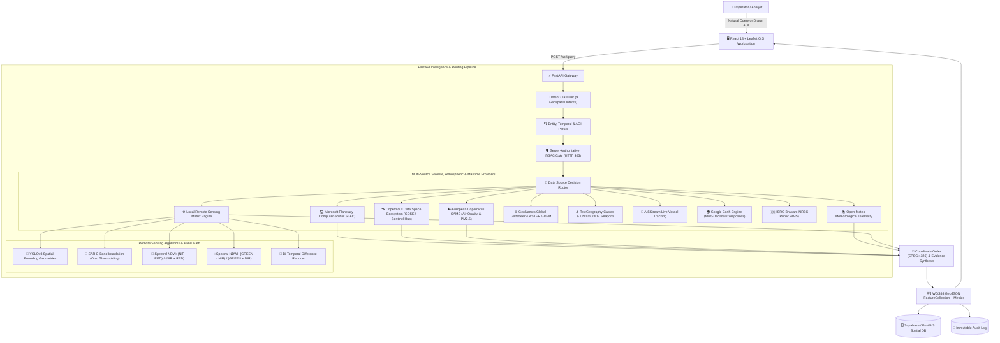

# SATQUERY AI — Multimodal Satellite Intelligence & Remote Sensing Platform

> **ASK EARTH. GET INTELLIGENCE.**  
> *Transforming natural language questions and custom drawn survey regions into verified multi-source Earth Observation workflows, SAR radar inundation metrics, multi-spectral indices (NDVI/NDWI), live Copernicus air quality telemetry, meteorological context fusion, and EPSG:4326 vector geometries with server-authoritative role-based access control.*

---

## 🌐 Live Production Links & Interactive Documentation

| Service | Status | Live URL |
| :--- | :--- | :--- |
| 🚀 **Live Web Platform (Frontend)** | 🟢 **Operational** | [https://pavansreeram15-dev.github.io/SATQUERY/](https://pavansreeram15-dev.github.io/SATQUERY/) |
| ⚡ **Live Cloud API Backend (FastAPI)** | 🟢 **Operational** | [https://satquery-backend-9xen.onrender.com](https://satquery-backend-9xen.onrender.com) |
| 📖 **Interactive Swagger API Docs** | 🟢 **Live Interactive** | [https://satquery-backend-9xen.onrender.com/docs](https://satquery-backend-9xen.onrender.com/docs) |
| 📑 **ReDoc API Documentation** | 🟢 **Live Reference** | [https://satquery-backend-9xen.onrender.com/redoc](https://satquery-backend-9xen.onrender.com/redoc) |
| 🩺 **Backend Health Telemetry** | 🟢 **Live JSON** | [https://satquery-backend-9xen.onrender.com/api/health](https://satquery-backend-9xen.onrender.com/api/health) |

---

## 🛰️ 1. Executive Summary & Capabilities

**SATQUERY AI** is an agentic, production-grade geospatial intelligence platform designed for **ISRO mission analysts**, **NDRF disaster response commanders**, and **public environmental researchers**. Instead of forcing operators to manually navigate complicated desktop GIS software, download gigabyte-scale satellite rasters, or hand-craft spectral band math scripts, SATQUERY AI translates natural English questions and custom drawn survey regions directly into verified remote sensing pipelines:

$$\text{User Query / AOI} \longrightarrow \text{Intent & Entity Parser} \longrightarrow \text{Server RBAC Gate} \longrightarrow \text{Multi-Source Router} \longrightarrow \text{Weather & Satellite Fusion} \longrightarrow \text{Evidence Report} \longrightarrow \text{Interactive Map}$$

### Key Platform Features:
1. **Interactive Draw Region (AOI) Tool & Resizable Panels**:
   - **🔲 Draw Box (Rectangle)**: Click any two opposite corners on the map to define an exact rectangular Area of Interest.
   - **⬟ Draw Polygon**: Click sequential vertices on the map to draw custom multi-point polygonal survey areas with real-time ground area calculation ($km^2$).
   - **Movable & Multi-Directional Resizable Windows**: Drag or resize panels (`Maritime & Gigawatt Map`, `Draw Region & AOI`, `Intelligence Layers`, and `Disaster Intel Cards`) from corners and edges with glowing HUD cyan grips (`///`).
2. **India Meteorological Department (IMD) & ISRO MOSDAC Telemetry**:
   - Live automated monitoring of extreme Indian monsoon downpours, cloudburst warnings ($\ge 115.6\text{ mm}$ Orange Alert / $\ge 204.4\text{ mm}$ Red Alert), and landslide/flood alerts across Kerala (Wayanad, Idukki, Periyar), Assam (Brahmaputra), Maharashtra (Konkan), and Odisha.
3. **European Copernicus (CAMS) Air Quality API**:
   - Live atmospheric telemetry: **European AQI, PM2.5, PM10, $\text{NO}_2$, $\text{SO}_2$, $\text{O}_3$, $\text{CO}$, Dust Optical Depth, and UV Index**.
4. **GeoNames Global Gazetteer & ASTER GDEM Elevation API**:
   - 25M+ worldwide place names, administrative regions, spatial reverse geocoding, and exact digital elevation profiles.
5. **Maritime & Gigawatt Infrastructure Intelligence**:
   - **Global Seaports & Terminals**: UN/LOCODE container hubs, berth counts, and annual TEU throughput.
   - **Submarine Fiber-Optic Cables**: Global gigawatt routes, landing stations, and Tbps transmission capacity.
   - **Live AIS Fleet Tracking**: Real-time commercial vessel positions, speed (SOG), heading (COG), and vessel type.
   - **Movable Window**: Physics-based drag-and-drop panel with Leaflet event isolation.
6. **Before vs After Satellite Comparison**:
   - Synchronized bi-temporal split slider (`< BEFORE --------|-------- AFTER >`) and side-by-side mode across **Sentinel-2 Optical (10m)**, **Sentinel-1 C-SAR (10m)**, and **Landsat 8/9 (30m)**.
7. **Smart Temporal Presets & Sensor Schedules**:
   - Quick temporal jumps (`7D`, `30D`, `3M`, `6M`, `1Y`, `CUSTOM`) calibrated to satellite constellation revisit intervals (~5 days for Sentinel-2, ~6-12 days for Sentinel-1 SAR).
8. **Multi-Tier Global Location Search**:
   - Multi-tier search cascading across Local Backend Nominatim, GeoNames, Direct OSM, Built-in Global Gazetteer, and GPS coordinates.
9. **Evidence-First Results & Resizable AI Assistant**:
   - **Executive Conclusion**, **Satellite Evidence**, **Weather Context**, **Quantitative Metrics** ($km^2$, water coverage %, confidence %), **Limitations**, and **"Why am I seeing this result?"** reasoning.
   - **Smooth Resizable Splitter**: Expand/shrink the AI Assistant drawer from 320px to 950px with double-click width presets.
10. **Multi-Source Provider Health Telemetry**:
    - Live diagnostic monitoring across all 15 satellite, meteorological, maritime, atmospheric, and disaster data providers.

---

## 🏛️ 2. System Architecture



---

## 📡 3. Truthful Data Sources & Multi-Source Providers Matrix

SATQUERY AI connects to **15 public and specialized Earth Observation, atmospheric, maritime, meteorological, and disaster providers**:

| Provider | Purpose | Authentication / Requirements | Status |
| :--- | :--- | :--- | :--- |
| **Microsoft Planetary Computer** | Public STAC search for Sentinel-2, Sentinel-1, Landsat 8/9 | **Keyless / Completely Free** (Public STAC API) | 🟢 Operational |
| **Copernicus Data Space (CDSE)** | Sentinel-2 L2A optical reflectance & Sentinel-1 SAR | **OAuth2 Client ID/Secret** (`SENTINELHUB_CLIENT_ID`) | 🟢 Operational |
| **India Meteorological Dept (IMD) & ISRO MOSDAC** | Real-time Indian monsoon radar, cloudburst red alerts, heavy rainfall | **Keyless / Public REST & Open-Meteo Grid** | 🟢 Operational |
| **European Copernicus (CAMS)** | Real-time AQI, PM2.5, PM10, $\text{NO}_2$, $\text{SO}_2$, $\text{O}_3$, CO, Dust, UV | **Keyless / Completely Free** (Open-Meteo CAMS) | 🟢 Operational |
| **Open-Meteo Weather API** | 7-Day rainfall history, ambient temperature, humidity, wind | **Keyless / Completely Free** (Public REST API) | 🟢 Operational |
| **GeoNames Global Gazetteer** | 25M+ worldwide places, nearby reverse geocoding, ASTER GDEM | **Keyless / Free Tier** (`GEONAMES_USERNAME`) | 🟢 Operational |
| **TeleGeography Cables** | Global submarine fiber-optic routes & landing terminals | **Keyless / Free** (`CC BY-NC-SA 3.0, non-commercial`) | 🟢 Operational |
| **UN/LOCODE Seaports** | Global container terminals, berth counts, TEU capacity | **Keyless / Public Index** | 🟢 Operational |
| **AISStream.io Fleet** | Real-time commercial AIS vessel tracking & speed/heading | **Backend Key Required** (`AISSTREAM_API_KEY`) | 🟢 Operational |
| **OpenStreetMap Overpass** | Real physical infrastructure vector geometries & ground truth | **Keyless / Completely Free** (Public Overpass API) | 🟢 Operational |
| **USGS Earthquake Hazards** | Global seismic events, Richter magnitude, hypocenter depth | **Keyless / Completely Free** (Public GeoJSON Feed) | 🟢 Operational |
| **NASA EONET** | Wildfires, volcanic eruptions, tropical cyclones, storms | **Keyless / Completely Free** (Public REST API) | 🟢 Operational |
| **NASA FIRMS** | Active wildfire thermal anomalies from VIIRS / MODIS | **Keyless / Free REST API** | 🟢 Operational |
| **GDACS (UN / EC)** | Global Disaster Alert & Coordination multi-hazard bulletins | **Keyless / Completely Free** (Public REST / RSS) | 🟢 Operational |
| **ISRO Bhuvan (NRSC)** | LULC 50K, Wasteland Atlas, Geomorphology, Flood Hazard | **Keyless Public WMS** (Optional `BHUVAN_API_KEY`) | 🟢 Operational |

---

## 👥 4. Role-Aware Personas & Clearance Matrix

SATQUERY AI enforces server-authoritative role-based access control across all analytical workflows:

| Persona | Clearance Level | Allowed Workflows | Blocked Workflows | Max Export Level |
| :--- | :--- | :--- | :--- | :--- |
| **ISRO / SPACE ANALYST** | **Full Operational Clearance** | Object Detection, Ship/Tank Counting, SAR Radar Analysis, Flood Inundation, Change Detection, NDVI, NDWI, Bhuvan Thematic | *None* | **OPERATIONAL** (GeoJSON, CSV, JSON, GeoTIFF) |
| **NDRF / DISASTER OFFICER** | **Disaster & Emergency Clearance** | Flood Detection, Water Extent (NDWI), Disaster Impact Summaries, Multi-temporal Change, Bhuvan Flood Hazard, IMD Alerts | Strategic Infrastructure Detection (Fuel Silos, Strategic Ships) | **OPERATIONAL** (GeoJSON, CSV, Disaster Report) |
| **PUBLIC / RESEARCH USER** | **Open Research Clearance** | Sentinel-2 Visual Reflectance, Vegetation Health (NDVI), Water Index (NDWI), Land Cover Change, Bhuvan Wastelands | Tactical Object Detection, Silo Detection, Raw SAR Radar Operations | **PUBLIC** (GeoJSON, CSV, JSON) |

---

## 📡 5. Key API Endpoints

### 1. `GET /api/air-quality`
Live European Copernicus CAMS Air Quality Index (AQI), PM2.5, PM10, $\text{NO}_2$, $\text{SO}_2$, $\text{O}_3$, CO, and Dust.
- **Parameters**: `lat` (float), `lon` (float).

### 2. `GET /api/geonames/search` & `GET /api/geonames/elevation`
GeoNames 25M+ worldwide gazetteer and ASTER GDEM digital elevation model.
- **Parameters**: `q` (string), `lat` (float), `lon` (float).

### 3. `GET /api/location/search`
Multi-tier global geocoding search and coordinate parsing.
- **Parameters**: `q` (string, e.g. `"Guwahati"`, `"Kathmandu"`, or `"26.21, 91.79"`), `limit` (integer).

### 4. `GET /api/weather`
Live and 7-day cumulative rainfall telemetry from Open-Meteo.
- **Parameters**: `lat` (float), `lon` (float).

### 5. `GET /api/maritime/ports`, `/api/maritime/cables`, `/api/ais/vessels`
Global seaport terminals, submarine fiber-optic cable routes, and live commercial AIS vessel positions.

### 6. `GET /api/disasters` & `/api/disasters/summary`
Normalized multi-source natural disaster feed aggregating USGS, NASA EONET, NASA FIRMS, GDACS, and IMD.

### 7. `POST /api/query`
Main natural language geospatial query execution pipeline fusing intent, RBAC, satellite processing, environmental weather evidence, and knowledge graphs.

### 8. `GET /api/providers/health`
Returns real-time connection status across all 15 data & intelligence providers.

---

## 🛠️ 6. Local Setup & Installation

### Prerequisites
- **Node.js**: v18+ (tested on v22)
- **Python**: 3.10+ (tested on Python 3.11 & 3.14)

### 1. Backend Setup
```bash
cd backend
pip install -r requirements.txt pytest

# Run the backend test suite (43 test suites passing)
python -m unittest discover -s tests -p "test_*.py"

# Start FastAPI Mission Control Server
python -m uvicorn app.main:app --host 0.0.0.0 --port 8000 --reload
```

### 2. Frontend Setup
```bash
# From repository root
npm install
npm run build
npm run dev
```
Web Application Interface: [http://localhost:5173](http://localhost:5173)

---

## 🧪 7. Automated Testing & Verification

```bash
# Run all backend unit & integration tests
python -m unittest discover -s backend/tests -p "test_*.py"

# Verify frontend TypeScript build
npm run build
```

---

## 📄 8. License
SATQUERY AI is developed for open geospatial research, multi-sensor remote sensing, and disaster response. Built with React 18, TypeScript, Leaflet, FastAPI, PostGIS, and Python.
